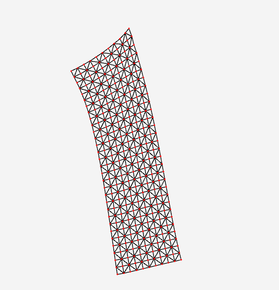
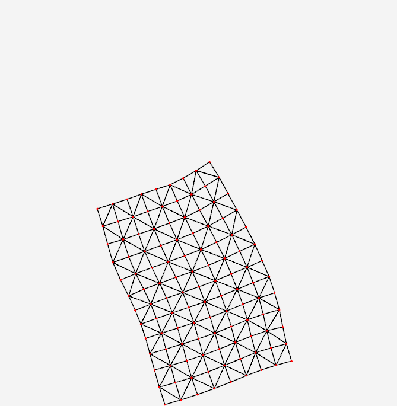
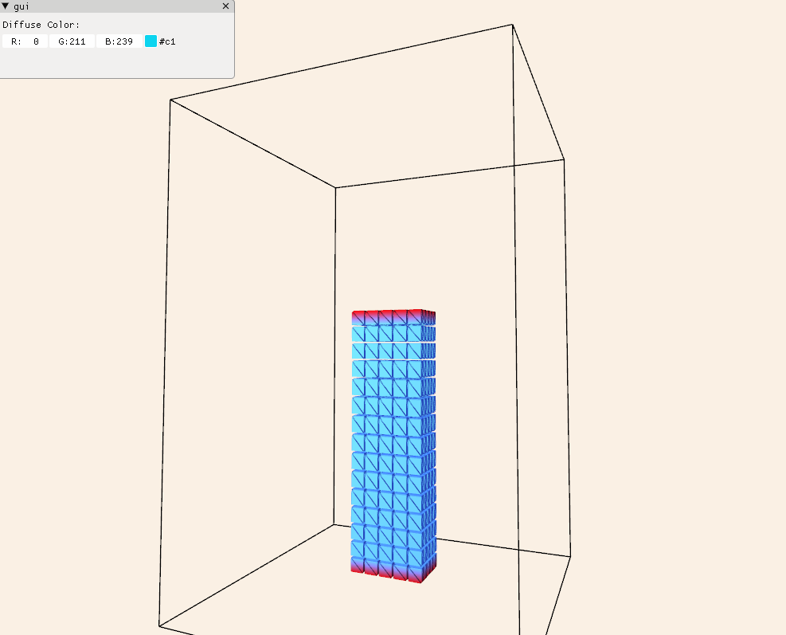

# ArmorerPhys

My own C++ research framework of modern OpenGL, integrating Eigen3, GLFW and libigl.

I aim at building a research framework that is self-contained, flexible and easy-to-use.

The core concept is the data-oriented design for flexibility and adaptability. There are only struct and functions. Based on function based pipeline, any new objects and functionalities can be easily added into the workflow.

## Dependencies

- Eigen3
- GLFW/GLAD
- libigl
- nlohmann_json
- tinygltf
- imgui

(All the dependencies will be audomatically downloaded by git submodule and cmake fetch content.)

## Design 

For example, here is how to add gui component:

```c++
  aphys::Gui gui = aphys::create_gui(window, "gui");

  aphys::Vec3f diffuse_color(0.0f, 211.f / 255.f, 239.f / 255.f);
  aphys::add_gui_func(gui, [&diffuse_color]() {
    ImGui::Text("Diffuse Color:");
    ImGui::ColorEdit3("#c1", diffuse_color.data());
  });
```

Defining callback functions in GLFW is always annoying. With function based pipeline, life is much easier. Callback functions can be added as many as wanted.

```c++
  // Create a singleton input handler 
  aphys::InputHandler& handler = aphys::create_input_handler(window);

  // Add mouse move input callback function
  aphys::add_mouse_move_func(handler, [&](aphys::InputHandler& input_handler) {
    std::cout << "mouse moving to " << handler.xpos << handler.ypos;
  });

  // Add mouse button input callback function 
  aphys::add_mouse_input_func(handler, [](aphys::InputHandler& input_handler,
                                          int button, int action) {
    std::cout << "mouse button event: " << button << " " << action << std::endl;
  });

  // Add keyboard input callback function
  aphys::add_key_input_func(
      handler, [](aphys::InputHandler& input_handler, int key, int action) {
        std::cout << "key event: " << key << " " << action << std::endl;
      });
```

This is how to add points and lines data into render pipeline:

```c++
  aphys::Matx2f v_p; // vertex position
  v_p.resize(2, 2);
  v_p << 1.0f, 1.0f,  //
      1.0f, 0.5f;     //
  aphys::Matx3f v_color; // per-vertex color
  v_color.resize(2, 3);
  v_color << 0.0f, 0.0f, 0.0f,  //
      1.0f, 0.2f, 0.0f;         //

  aphys::Points points = aphys::create_points(); // create points object
  aphys::set_points_data(points, v_p, v_color);
  // add points to render pipeline
  aphys::add_render_func(scene, aphys::get_render_func(points)); 
  
  aphys::Lines lines = aphys::create_lines(); // create lines object
  aphys::set_lines_data(lines, v_p, v_color);
  // add lines to render pipeline
  aphys::add_render_func(scene, aphys::get_render_func(lines));
```

Rendering new objects can be easily added as render functions.

In each frame the scene is built by iterating through all render functions, as well as input functions and gui functions.

```c++
  for (RenderFunc func : scene.render_funcs) {
    func(scene);
  }
```

Input and gui functions work similarly. 

## Selected results:

### 04_pipeline

Show how to use the pipeline of render, mouse/keyboard input and gui functions pipeline.

Orbit control is defined for default camera: A/D/Q/E to rotate, W/S to zoom in/out.


### 05_2d_game

A mass spring simulation with adjustable physics parameters.


### 06_interactive_pbd

An interactable pbd simulation of 2D deformable objects. 



### Mathplot2d 

Draw axis, grids, points and lines in 2d space.

To be added: Triangles, parameter curve, splines


### 12_fem_neohookean

Implementing 2D deformable simulation from [stable neohookean flesh simulation](https://www.tkim.graphics/NEO/StableNeoHookean2018.pdf).



### 13_pd_3d

3D projective dynamics simulation.



## TODO

- [ ] Export simulated animation to gltf
- [ ] Cloth simulation by projective dynamics
